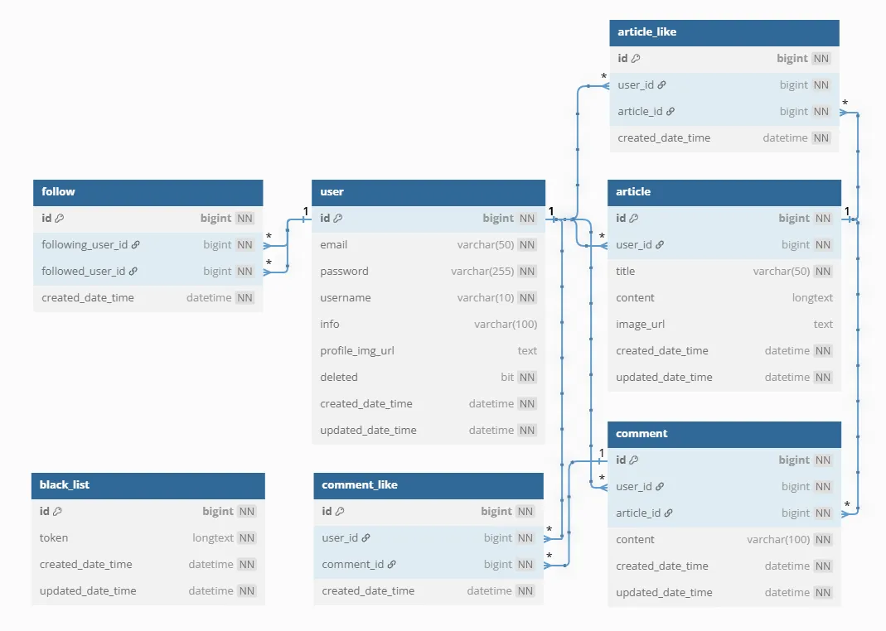
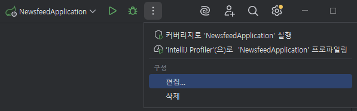
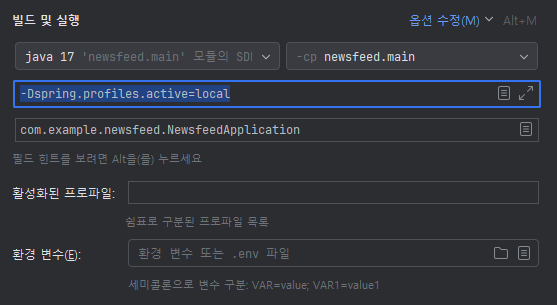
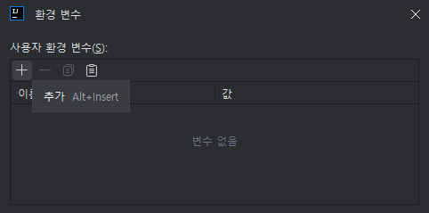
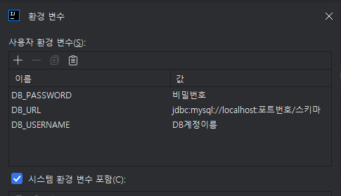
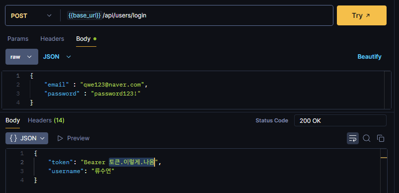
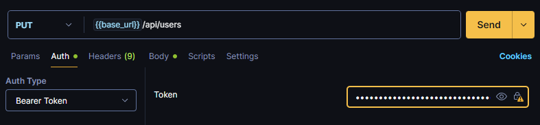

# Newsfeed

뉴스피드 개발 프로젝트

## 프로젝트 소개

Spring Boot에서 JPA와 JWT에 대한 이해를 바탕으로, 실제로 사용될 수 있는 뉴스피드 기능을 구현합니다.

## 사용하는 기술

`Java` `Spring Boot` `Github` `MySQL` `JPA` `JWT`

## 설계

### 와이어프레임
[와이어프레임 by notion](https://www.notion.so/teamsparta/2002dc3ef51480a0a2b0c849619fad30)

### ERD

[ERD by notion](https://www.notion.so/teamsparta/ERD-2002dc3ef51480d58ca8eed56bd0218c)



### API 명세서
[API by notion](https://www.notion.so/teamsparta/API-2002dc3ef514809ab0a2d060b1757a19)


## 사용법

<details>
<summary> 환경변수 설정하기 </summary>

---

### 0. 현재 설정

현재 설정에 따라 환경 변수 `DB_URL`, `DB_USERNAME`, `DB_PASSWORD` 을 설정해야하는 상황

```yaml
spring:
  datasource:
    url: ${DB_URL}
    username: ${DB_USERNAME}
    password: ${DB_PASSWORD}
```

### 1. 환경변수 설정하기



### 2. 옵션 추가하기

`빌드 및 실행` 항목의   <u>옵션 수정(M)</u> 선택

아래 내용 체크 표시

    환경변수
    VM 옵션 추가

1. VM 옵션에 `-Dspring.profiles.active=local` 추가
2. <u>환경 변수(E)</u> 의 파일모양 📄 선택



### 3. 환경변수 설정하기

필요한 환경변수 추가 후 적용



---

</details>

<details>

<summary> Postman 에서 로그인 하는법 </summary>

1. 로그인 후, token의 Bearer 뒷부분을 복사한다.



2. 로그인이 필요한 api 요청에서, **Auth의 Auth Type**에 **Bearer Token**을 선택한다.
3. 복사한 토큰을 token에 입력한다.



</details>


## 프로젝트 구조

```
schedule-app/
├── src/
│   ├── main/java/
│   │   └── com/example/scheduleapp/
│   │       ├── article/
│   │       │   ├── controller/
│   │       │   │   ├── dto/
│   │       │   │   │   ├── ArticleReqDto.java
│   │       │   │   │   └── ArticleResDto.java
│   │       │   │   └── ArticleController.java
│   │       │   ├── domain/
│   │       │   │   ├── entity/
│   │       │   │   │   └── Article.java
│   │       │   │   └── repository/
│   │       │   │       └── ArticleRepository.java
│   │       │   └── service/
│   │       │       └── ArticleService.java
│   │       ├── comment/
│   │       ├── follow/
│   │       ├── glbal/
│   │       │   ├── common/
│   │       │   ├── config/
│   │       │   ├── dto/
│   │       │   ├── exception/
│   │       │   └── filter/
│   │       ├── like/
│   │       └── user/
│   └── resources/
│       ├── static/
│       ├── templates/
│       └── application.yml
├── build.gradle
├── readme/
└── README.md
```